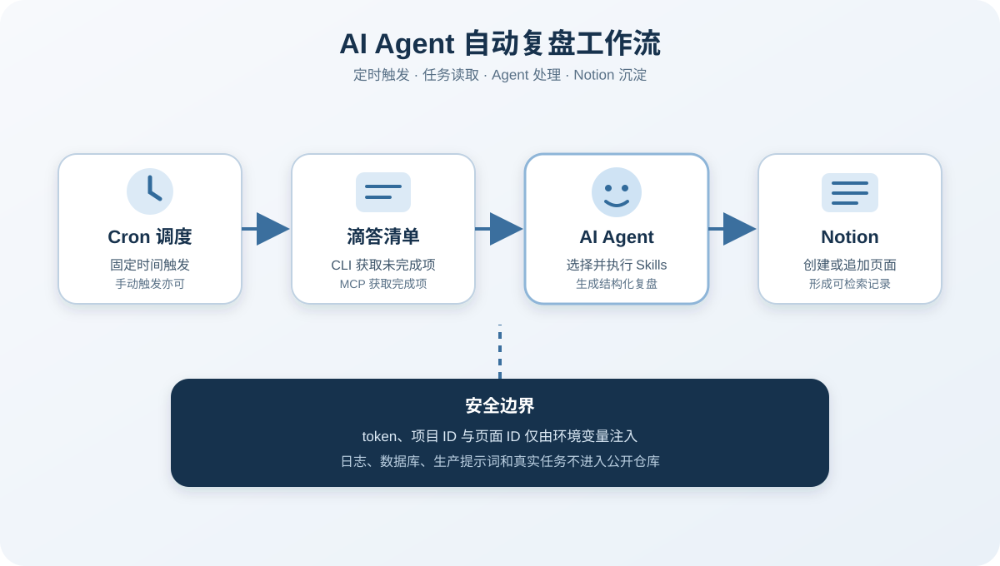

# AI Agent 自动复盘工作流

这是一套经过脱敏重构的个人自动化工作流示例。它把定时触发、滴答清单任务读取、AI Agent 处理和 Notion 沉淀串成一个可复用闭环。

> 公开说明：本仓库源于真实运行过的个人工作流。代码、配置和输出均为安全重构版本，不包含生产 token、页面 ID、项目 ID、原始任务、运行日志或个人行为记录。`examples/` 中的数据均为合成示例。



## 能解决什么问题

- 在固定时间拉取未完成任务或指定时间窗口内的已完成任务。
- 将任务数据交给 Agent 生成日、周、月复盘草稿。
- 把结构化结果写入 Notion 页面。
- 用环境变量隔离凭据，避免把生产配置带进代码仓库。
- 为定时任务提供可审查、可替换的提示词结构。

## 数据流

1. 调度器按照 Cron 规则触发任务。
2. 滴答脚本通过本地 CLI 或官方 MCP 获取任务数据。
3. Agent 根据选定 Skill 整理任务、复盘和下一步行动。
4. Notion 脚本通过 API 创建或追加页面。
5. 运行结果只保留必要状态，生产日志和数据库不进入版本库。

## 仓库结构

```text
hermes-auto-workflow/
├── README.md
├── LICENSE
├── .env.example
├── .gitignore
├── scripts/
│   ├── dida_undone.py
│   ├── dida_completed_mcp.py
│   ├── notion_api.py
│   └── notion_bridge.py
├── skills/
│   ├── README.md
│   ├── cognitive-awakening/SKILL.md
│   ├── execution-guard/SKILL.md
│   ├── task-breakdown/SKILL.md
│   └── notion-bridge/SKILL.md
├── docs/
│   ├── architecture.md
│   ├── architecture.svg
│   ├── cron-setup.md
│   └── troubleshooting.md
└── examples/
    ├── daily-review.example.md
    ├── weekly-review.example.md
    └── cron-jobs.example.json
```

## 快速开始

### 1. 准备环境

需要 Python 3.10 或更高版本。四个脚本只使用 Python 标准库，不需要额外安装依赖。

复制环境变量模板并填写自己的值。不要把真实 `.env` 提交到版本库。

```powershell
Copy-Item .env.example .env
```

PowerShell 临时设置示例：

```powershell
$env:DIDA_API_TOKEN = "<YOUR_DIDA_API_TOKEN>"
$env:DIDA_PROJECTS_JSON = '[{"id":"<PROJECT_ID>","name":"示例清单"}]'
$env:NOTION_API_KEY = "<YOUR_NOTION_API_KEY>"
$env:NOTION_PARENT_PAGE_ID = "<PARENT_PAGE_ID>"
$env:NOTION_DIARY_PAGE_ID = "<DIARY_PAGE_ID>"
```

### 2. 读取未完成任务

本脚本依赖本机已安装并完成登录的 `dida` CLI。

```powershell
python scripts/dida_undone.py
python scripts/dida_undone.py --project-names "示例清单"
```

### 3. 读取已完成任务

```powershell
python scripts/dida_completed_mcp.py --start 2026-08-01 --end 2026-08-08
python scripts/dida_completed_mcp.py --start 2026-08-01 --redact-titles
```

### 4. 生成复盘并写入 Notion

先用 `--dry-run` 查看 Markdown，不访问网络。

```powershell
python scripts/notion_bridge.py weekly --date 2026-08-08 `
  --highlights "完成接口联调|补充异常处理" `
  --challenges "测试数据不足" `
  --actions "补齐边界用例|复查输出" `
  --dry-run
```

确认内容后去掉 `--dry-run`，脚本才会调用 Notion API。

## 配置变量

| 变量 | 必需 | 用途 |
|---|---|---|
| `DIDA_API_TOKEN` | 读取已完成任务时必需 | 滴答官方 MCP Bearer token |
| `DIDA_PROJECTS_JSON` | 读取未完成任务时必需 | 项目 ID 与显示名的 JSON 数组 |
| `DIDA_CLI_PATH` | 可选 | `dida` CLI 路径，默认自动查找 |
| `DIDA_MCP_URL` | 可选 | MCP 地址，默认使用官方地址 |
| `NOTION_API_KEY` | 写入 Notion 时必需 | Notion Integration token |
| `NOTION_PARENT_PAGE_ID` | 周、月、年复盘必需 | 复盘父页面 ID |
| `NOTION_DIARY_PAGE_ID` | 日复盘必需 | 日记父页面 ID |
| `NOTION_API_VERSION` | 可选 | Notion API 版本 |

## 安全设计

- 代码不读取 Hermes 的 `.env`、`config.yaml`、数据库或日志。
- 凭据只从进程环境变量读取。
- 缺少环境变量时，脚本给出变量名和设置说明，不回显任何已有值。
- 项目 ID、页面 ID 和任务标题不出现在仓库示例中。
- Cron 示例只展示结构，不复制真实提示词。
- `.gitignore` 排除凭据、数据库、日志和本地输出。

## 验证

```powershell
python -m compileall scripts
python scripts/dida_undone.py --help
python scripts/dida_completed_mcp.py --help
python scripts/notion_api.py --help
python scripts/notion_bridge.py --help
```

更完整的设计说明见 [架构详解](docs/architecture.md)，调度配置见 [定时任务配置](docs/cron-setup.md)，常见故障见 [排错手册](docs/troubleshooting.md)。

## 许可

本仓库代码和原创文档使用 MIT License。仓库不包含原始生产配置、第三方方法论原文或第三方平台数据。
